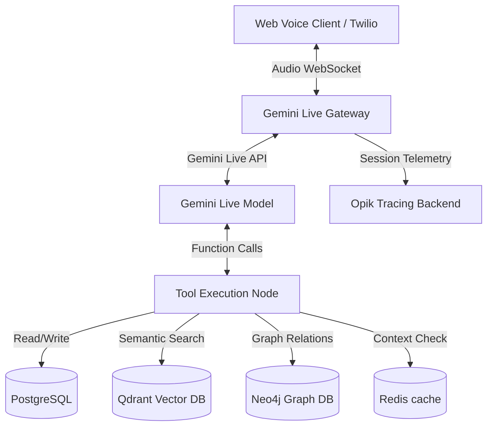

# Maskan (VoiceAqar) — Egyptian Arabic Real-Estate Voice Agent

Maskan (VoiceAqar) is an advanced, production-grade conversational voice assistant tailored for the Egyptian real estate market. Built on the **Gemini Live API (WebSockets)** and **LangGraph**, it enables natural, real-time bidirectional voice search, user onboarding, and viewing appointment bookings entirely in the Egyptian Arabic dialect.

---

## 🚀 Key Features

*   **Real-time Speech-to-Speech (Gemini Live API)**: Bidirectional audio streaming (PCM/μ-law) over WebSockets with sub-second response times.
*   **Conversational Agent Orchestration (LangGraph)**: Multi-turn dialog states, safety guardrails, and tool-calling routing built on a compiled React Agent.
*   **Multi-layered Memory System**:
    *   *Relational Memory (Postgres / Drizzle)*: Session state checkpointer and core user profiles.
    *   *Semantic Vector Memory (Qdrant)*: High-dimensional property listings vector search matching semantic user queries.
    *   *Transient Working Memory (Redis)*: Sliding-window conversation turns context management.
    *   *Knowledge Graph Memory (Neo4j)*: Long-term semantic relationships (e.g., User → Preferences, User → Budgets, User → Bookings).
*   **Observability & Telemetry (Opik)**: Fully traced API calls, cost tracking, turn-by-turn P50/P90 latency calculation, and LLM-as-a-judge qualitative evaluations.
*   **Regression Evaluation Harness**: Integrated test suite executing 10 golden scenarios assessing intent matching, safety rejections, and tool argument extraction.

---

## 🛠 Tech Stack

*   **Runtime**: Node.js & TypeScript
*   **Agent framework**: LangChain / LangGraph
*   **LLM API**: Google Gemini Live API & OpenRouter / Groq (for text & evaluation)
*   **Relational DB / ORM**: PostgreSQL & Drizzle ORM
*   **Vector Database**: Qdrant (Rest client)
*   **Graph Database**: Neo4j (Bolt protocol)
*   **Caching & Session Storage**: Redis
*   **Telemetry**: Opik SDK

---

## ⚙️ Architecture Overview



---

## 📋 Tool Registries

*   `property_retrieval`: Searches semantic property database matching description, location, compound, and exact constraints (bedrooms, budget range, area).
*   `save_user_profile`: Registers the user's name and phone number in PostgreSQL and Neo4j.
*   `save_user_preferences`: Stores preferred budget ranges and property types in the Neo4j knowledge graph.
*   `check_calendar_slots`: Queries company calendar for upcoming viewing availabilities.
*   `book_appointment`: Schedules a viewing slot for a chosen property.

---

## 🚦 Getting Started

### 1. Prerequisites
Ensure you have Node.js (v18+), Docker, and Docker Compose installed.

### 2. Environment Configuration
Copy the `.env.example` file to `.env` and fill in the required api keys:
```bash
cp .env.example .env
```
Key variables to provide:
*   `GEMINI_API_KEY`: Google GenAI API Key.
*   `OPIK_API_KEY`: Comet Opik Observability token.
*   `LLM_PROVIDER`: Set to `openrouter`, `groq`, or `gemini`.
*   `OPENROUTER_API_KEY`: If using OpenRouter.

### 3. Spin Up Infrastructure
Launch the PostgreSQL, Redis, Qdrant, and Neo4j database containers:
```bash
docker-compose up -d
```

### 4. Database Setup & Seeding
Apply relational database schema migrations, seed mock properties, and generate vector embeddings to index in Qdrant:
```bash
# Apply migrations & seed Postgres
npm run db:setup

# Generate vector embeddings & seed Qdrant
npx tsx src/scripts/index_properties.ts
```

### 5. Running the Dev Server
Start the HTTP and WebSocket Gateway server:
```bash
npm run dev
```
*   **Web Client (Voice)**: `http://localhost:3000/voice`
*   **Web Client (Text)**: `http://localhost:3000/chat`

---

## 🧪 Evaluation & Testing

The project isolates evaluation routines into a dedicated `eval/` folder to automate regression testing without database side-effects.

### Running Regression Benchmarks
Before executing tests, the script automatically purges test users from Postgres and Neo4j to ensure deterministic runs.
```bash
# Run Golden Dataset evaluation & flush qualitative metrics to Opik
npm run eval:regression
```
This script evaluates the agent on:
*   **Deterministic Assertions**: Checks whether the correct tool calls were triggered and matches expected substring tokens in agent output.
*   **E2E Latency**: Captures and logs P50 and P90 turn-level response latency.
*   **LLM-as-a-Judge**: Leverages Gemini 2.5 Flash as an automated quality judge scoring conversation intent, response relevance, and goal completions.