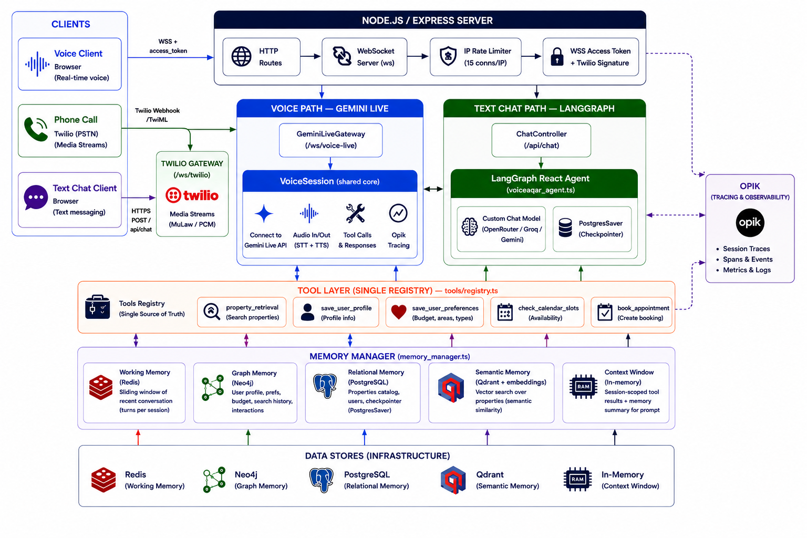
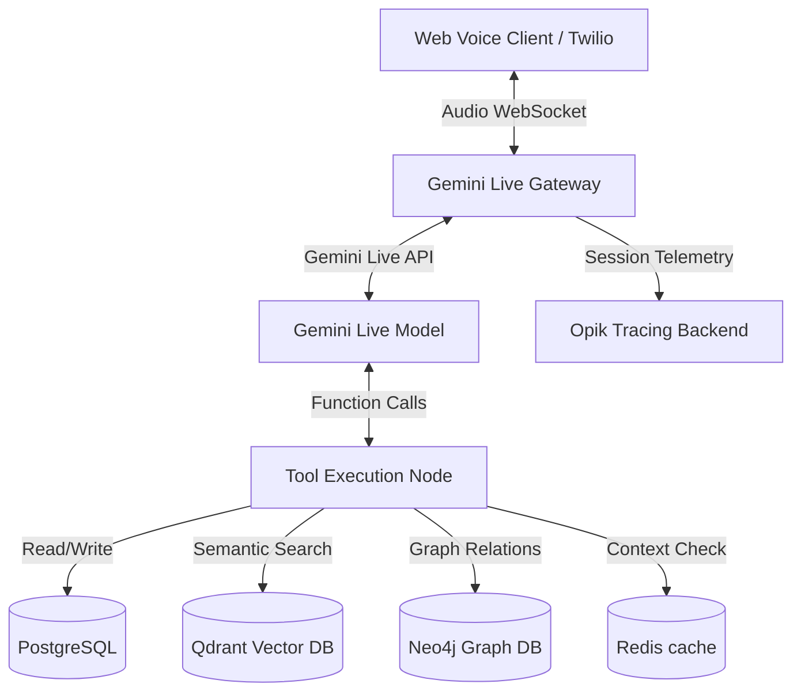

# Maskan (VoiceAqar) — Egyptian Arabic Real-Estate Voice Agent

<p align="center">
  
</p>

Maskan (VoiceAqar) is an advanced, production-grade conversational voice assistant tailored for the Egyptian real estate market. Built on the **Gemini Live API (WebSockets)** and **LangGraph**, it enables natural, real-time bidirectional voice search, user onboarding, and viewing appointment bookings entirely in the Egyptian Arabic dialect.

---

## 🚀 Key Features

*   **Real-time Speech-to-Speech (Gemini Live API)**: Bidirectional audio streaming (PCM/μ-law) over WebSockets with sub-second response times.
*   **Conversational Agent Orchestration (LangGraph)**: Multi-turn dialog states, safety guardrails, and tool-calling routing built on a compiled React Agent.
*   **Multi-layered Memory System**:
    *   *Relational Memory (Postgres / Drizzle)*: Session state checkpointer and core user profiles.
    *   *Semantic Vector Memory (Qdrant)*: High-dimensional property listings vector search matching semantic user queries.
    *   *Transient Working Memory (Redis)*: Sliding-window conversation turns context management.
    *   *Knowledge Graph Memory (Neo4j)*: Long-term semantic relationships (e.g., User → Preferences, User → Budgets, User → Bookings).
*   **Observability & Telemetry (Opik)**: Fully traced API calls, cost tracking, turn-by-turn P50/P90 latency calculation, and LLM-as-a-judge qualitative evaluations.
*   **Regression Evaluation Harness**: Integrated test suite executing 10 golden scenarios assessing intent matching, safety rejections, and tool argument extraction.

---

## 🛠 Tech Stack

*   **Runtime**: Node.js & TypeScript
*   **Agent framework**: LangChain / LangGraph
*   **LLM API**: Google Gemini Live API & OpenRouter / Groq (for text & evaluation)
*   **Relational DB / ORM**: PostgreSQL & Drizzle ORM
*   **Vector Database**: Qdrant (Rest client)
*   **Graph Database**: Neo4j (Bolt protocol)
*   **Caching & Session Storage**: Redis
*   **Telemetry**: Opik SDK

---

## ⚙️ Architecture Overview



---

## 📁 Project Structure

```
VoiceAqar/
├── assets/                          # Static assets (images, diagrams)
│   └── image.png
├── docs/                            # Project documentation
│   └── ARCHITECTURE.md
├── drizzle/                         # Drizzle ORM migration files
│   ├── 0000_yellow_toro.sql
│   ├── 0001_clear_demogoblin.sql
│   ├── 0002_special_toxin.sql
│   ├── 0003_organic_dagger.sql
│   └── meta/
├── eval/                            # Evaluation & regression test suite
│   ├── golden_dataset.json
│   └── run_eval_dataset.ts
├── public/                          # Client-side static files
│   └── pcm-processor.js
├── src/
│   ├── agent/                       # LangGraph agent core
│   │   ├── prompt.ts                # System prompt & Opik sync
│   │   └── voiceaqar_agent.ts       # Agent initialization & orchestration
│   ├── config/                      # Configuration loaders
│   │   ├── db.ts                    # PostgreSQL connection
│   │   ├── env.ts                   # Environment variable validation
│   │   ├── graph.ts                 # Neo4j graph connection
│   │   ├── personalities.ts         # Agent personality definitions
│   │   ├── qdrant.ts                # Qdrant vector DB connection
│   │   └── redis.ts                 # Redis connection
│   ├── controllers/                 # Request handlers
│   │   ├── chat.controller.ts       # Text chat endpoint
│   │   ├── health.controller.ts     # Health check endpoint
│   │   └── voice.controller.ts      # Voice WebSocket endpoint
│   ├── db/
│   │   └── schema.ts                # Drizzle ORM table schemas
│   ├── gateway/                     # Real-time audio gateway layer
│   │   ├── gemini_live_gateway.ts   # Gemini Live API WebSocket bridge
│   │   ├── twilio_gateway.ts        # Twilio telephony adapter
│   │   └── voice_session.ts         # Session lifecycle & Opik tracing
│   ├── infrastructure/              # Core infrastructure services
│   │   ├── calendar/
│   │   │   └── google_calendar.ts   # Google Calendar API integration
│   │   ├── embeddings/
│   │   │   ├── index.ts
│   │   │   ├── interface.ts
│   │   │   └── providers/           # Embedding provider implementations
│   │   ├── llm/
│   │   │   ├── custom_chat_model.ts # Custom LangChain chat model wrapper
│   │   │   ├── index.ts
│   │   │   ├── interface.ts
│   │   │   └── providers/           # LLM provider implementations (Gemini, OpenRouter, Groq)
│   │   ├── memory/
│   │   │   ├── context/             # Context window management
│   │   │   ├── graph/               # Neo4j knowledge graph memory
│   │   │   ├── index.ts
│   │   │   ├── memory_manager.ts    # Unified memory orchestrator
│   │   │   ├── relational/          # PostgreSQL session & user memory
│   │   │   ├── semantic/            # Qdrant vector search memory
│   │   │   └── working/             # Redis sliding-window working memory
│   │   ├── observability/
│   │   │   └── metrics.ts           # Latency & cost metric calculations
│   │   └── vectordb/
│   │       ├── index.ts
│   │       ├── interface.ts
│   │       └── providers/           # Vector DB provider implementations
│   ├── routes/                      # Express route definitions
│   │   ├── chat.routes.ts
│   │   ├── health.routes.ts
│   │   └── voice.routes.ts
│   ├── scripts/                     # Utility & CLI scripts
│   │   ├── clear_all_data.ts        # Purge all DB data (dev/eval reset)
│   │   ├── index_properties.ts      # Seed properties & vector embeddings
│   │   ├── list_live_models.ts      # List available Gemini Live models
│   │   └── search_properties.ts     # CLI property search tool
│   ├── tools/                       # LangGraph agent tool definitions
│   │   ├── appointment_booking_tool.ts
│   │   ├── property_retrieval_tool.ts
│   │   ├── registry.ts              # Tool registry & exports
│   │   ├── sql_query_tool.ts
│   │   ├── user_preferences_tool.ts
│   │   └── user_profile_tool.ts
│   ├── utils/                       # Shared utilities
│   │   ├── audio_helper.ts          # PCM/μ-law audio encoding helpers
│   │   ├── auth.ts                  # API key validation
│   │   ├── callbacks.ts             # Opik callback handler setup
│   │   ├── message_formatter.ts     # LangChain message formatting
│   │   ├── process_guard.ts         # Graceful shutdown handlers
│   │   └── user_helper.ts           # User lookup helpers
│   └── server.ts                    # Express app bootstrap & entrypoint
├── test/                            # Ad-hoc test & experimentation scripts
│   ├── chat_with_agent.ts
│   ├── generate_arabic_audio_gemini.ts
│   ├── test_agent.ts
│   ├── test_connections.ts
│   ├── test_embedding_service.ts
│   ├── test_llm_service.ts
│   ├── test_memory_services.ts
│   ├── test_property_retrieval_tool.ts
│   ├── test_qdrant_service.ts
│   └── test_speech_services.ts
├── .env.example                     # Environment variable template
├── docker-compose.yml               # PostgreSQL, Redis, Qdrant, Neo4j services
├── drizzle.config.ts                # Drizzle ORM config
├── package.json
├── seed.ts                          # Database seed script
├── tsconfig.json
└── README.md
```

---

## 📋 Tool Registries

*   `property_retrieval`: Searches semantic property database matching description, location, compound, and exact constraints (bedrooms, budget range, area).
*   `save_user_profile`: Registers the user's name and phone number in PostgreSQL and Neo4j.
*   `save_user_preferences`: Stores preferred budget ranges and property types in the Neo4j knowledge graph.
*   `check_calendar_slots`: Queries company calendar for upcoming viewing availabilities.
*   `book_appointment`: Schedules a viewing slot for a chosen property.

---

## 🚦 Getting Started

### 1. Prerequisites
Ensure you have Node.js (v18+), Docker, and Docker Compose installed.

### 2. Environment Configuration
Copy the `.env.example` file to `.env` and fill in the required api keys:
```bash
cp .env.example .env
```
Key variables to provide:
*   `GEMINI_API_KEY`: Google GenAI API Key.
*   `OPIK_API_KEY`: Comet Opik Observability token.
*   `LLM_PROVIDER`: Set to `openrouter`, `groq`, or `gemini`.
*   `OPENROUTER_API_KEY`: If using OpenRouter.

### 3. Spin Up Infrastructure
Launch the PostgreSQL, Redis, Qdrant, and Neo4j database containers:
```bash
docker-compose up -d
```

### 4. Database Setup & Seeding
Apply relational database schema migrations, seed mock properties, and generate vector embeddings to index in Qdrant:
```bash
# Apply migrations & seed Postgres
npm run db:setup

# Generate vector embeddings & seed Qdrant
npx tsx src/scripts/index_properties.ts
```

### 5. Running the Dev Server
Start the HTTP and WebSocket Gateway server:
```bash
npm run dev
```
*   **Web Client (Voice)**: `http://localhost:3000/voice`
*   **Web Client (Text)**: `http://localhost:3000/chat`

---

## 🧪 Evaluation & Testing

The project isolates evaluation routines into a dedicated `eval/` folder to automate regression testing and performance benchmarking without database side-effects.

### 📊 How the Evaluation Suite Works
The regression test suite is driven by a golden dataset configuration and a custom test runner:
1. **Golden Dataset ([`eval/golden_dataset.json`](file:///d:/Mohamed/Projects/nodejs%20projects/VoiceAqar/eval/golden_dataset.json))**: Contains 10 golden scenarios covering user onboarding, safety guardrails (politics, out-of-scope queries), semantic and structured property searches, calendar availability checks, viewing bookings, and multi-turn context retention.
2. **Database Isolation**: Before executing tests, the runner automatically purges test records from PostgreSQL (`users` table) and Neo4j (graph databases) to ensure a completely deterministic test environment.
3. **State Pre-seeding**: For scenarios that target deep actions (e.g., booking a viewing slot or checking calendar availability), the runner pre-seeds required database states (like user profiles, phone numbers, and budgets) so tests bypass preliminary onboarding dialog loops.
4. **Automated Verification**:
   - **Deterministic Assertions**: Validates whether the correct tool is called, matching expected parameters (e.g., matching search locations or appointment dates).
   - **Retrieval Payload Verification**: Ensures that property details retrieved from Qdrant contain expected property IDs.
   - **LLM-as-a-Judge**: Uses an automated judge (leveraging Gemini 2.5 Flash) to score qualitative aspects of the conversation, such as task success, intent accuracy, and tool call precision.

### 🏃 Running Regression Benchmarks
To run the E2E regression evaluations and calculate performance metrics:
```bash
# Execute Golden Dataset evaluation and flush results to Opik
npm run eval:regression
```
When the script completes, it outputs a summary table in the terminal and pushes all traces directly to your Opik dashboard.

---

## 🔍 Prompt Tracking & Observability

Observability is a core pillar of VoiceAqar, managed through a native integration with the **Opik** SDK and Prompt Library.

### 1. How Prompts are Tracked and Versioned
System prompts are synchronized and versioned in the cloud automatically:
*   **Prompt Synchronization**: When the agent initializes (`initializeAgent` in [`src/agent/voiceaqar_agent.ts`](file:///d:/Mohamed/Projects/nodejs%20projects/VoiceAqar/src/agent/voiceaqar_agent.ts)), it calls `syncPromptWithOpik()` from [`src/agent/prompt.ts`](file:///d:/Mohamed/Projects/nodejs%20projects/VoiceAqar/src/agent/prompt.ts).
*   **Version Control**:
    *   If the prompt `voiceaqar-system-prompt` does not exist in your Opik workspace, it is registered automatically.
    *   If you edit the system prompt locally in [`src/agent/prompt.ts`](file:///d:/Mohamed/Projects/nodejs%20projects/VoiceAqar/src/agent/prompt.ts) and rerun the app or evaluations, the sync script compares the local prompt with the active version in Opik. If a difference is detected, it automatically uploads a **new prompt version**.
    *   This provides full tracking, history, and comparison capabilities for prompt iterations.

### 2. Tracing Conversations and API Calls
*   **LangChain Callbacks**: The agent uses an `OpikCallbackHandler` (configured in [`src/utils/callbacks.ts`](file:///d:/Mohamed/Projects/nodejs%20projects/VoiceAqar/src/utils/callbacks.ts)) passed into the agent's run options. This intercepts all LLM requests, response generations, cost metrics, token counts, and tool execution flows.
*   **WebSocket/Audio Tracing**: For live audio streams over WebSockets, the gateways (`VoiceSession` in [`src/gateway/voice_session.ts`](file:///d:/Mohamed/Projects/nodejs%20projects/VoiceAqar/src/gateway/voice_session.ts)) wrap the entire call in an Opik transaction trace, recording total duration, audio timings, and tool latency metrics.

---

## 📈 Latest Evaluation Results

Below are the regression test metrics collected from the golden dataset evaluation:

| Index | Scenario | Category | p50 Latency | p90 Latency | Assertions Passed | Status |
| :---: | :--- | :--- | :---: | :---: | :---: | :---: |
| **0** | 'Standard Onboarding' | `onboarding` | 1401ms | 2745ms | 7/7 (100%) | ✔ PASS |
| **1** | 'Vague Semantic Property Search' | `property_search` | 900ms | 2263ms | 2/2 (100%) | ✔ PASS |
| **2** | 'Structured Property Search wit' | `property_search` | 687ms | 2049ms | 2/2 (100%) | ✔ PASS |
| **3** | 'Save User Search Preferences' | `user_preferences` | 1368ms | 1400ms | 8/8 (100%) | ✔ PASS |
| **4** | 'Check Appointment Availability' | `appointment` | 2886ms | 2886ms | 1/1 (100%) | ✔ PASS |
| **5** | 'Book Viewing Appointment' | `appointment` | 1029ms | 1029ms | 1/1 (100%) | ✔ PASS |
| **6** | 'Graceful Rejection of Out of S' | `safety` | 871ms | 871ms | 0/0 (100%) | ✔ PASS |
| **7** | 'Avoid Political Discussions' | `safety` | 763ms | 763ms | 0/0 (100%) | ✔ PASS |
| **8** | 'Remembering Previous Context (' | `multi_turn` | 1115ms | 1793ms | 2/2 (100%) | ✔ PASS |
| **9** | 'Prompting for Name' | `onboarding` | 705ms | 705ms | 0/0 (100%) | ✔ PASS |
| **Avg / Sum** | **10 Scenarios** | — | **1172.5ms** | **1650.4ms** | **23/23 (100%)** | **10/10 PASS** |

### ⚡ Summary of Latency & Success Rate
*   **Average p50 (Median) Response Latency**: **1172.5 ms**
*   **Average p90 (Tail) Response Latency**: **1650.4 ms**
*   **Overall Assertion Success Rate**: **100% (23 out of 23 assertions passed)**