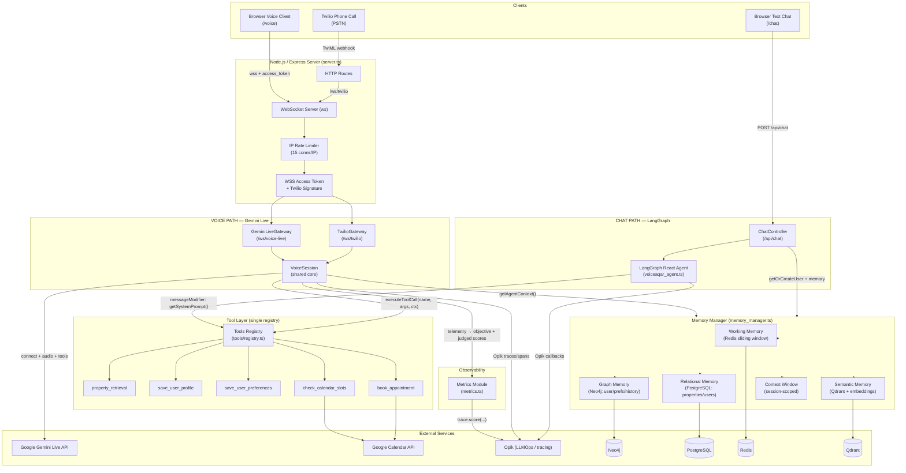
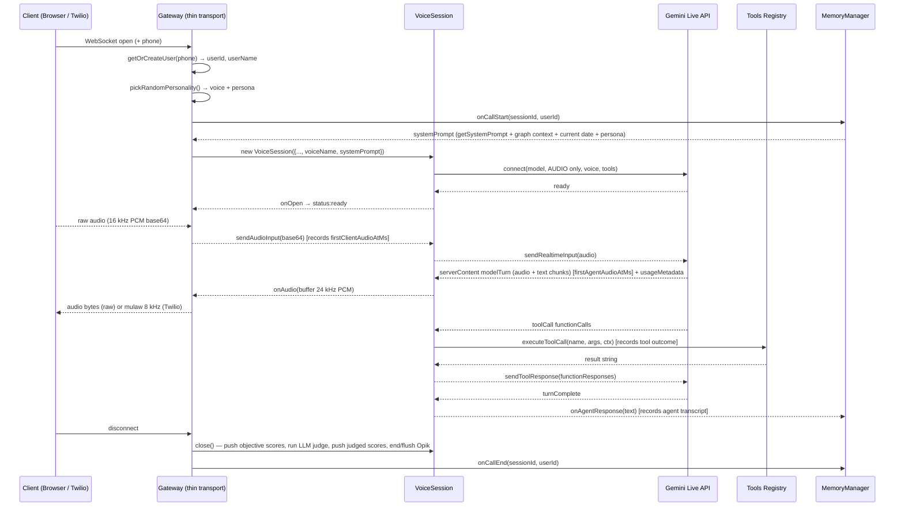
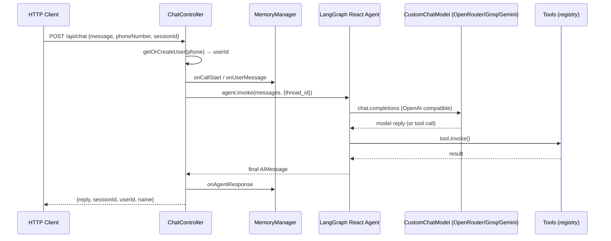
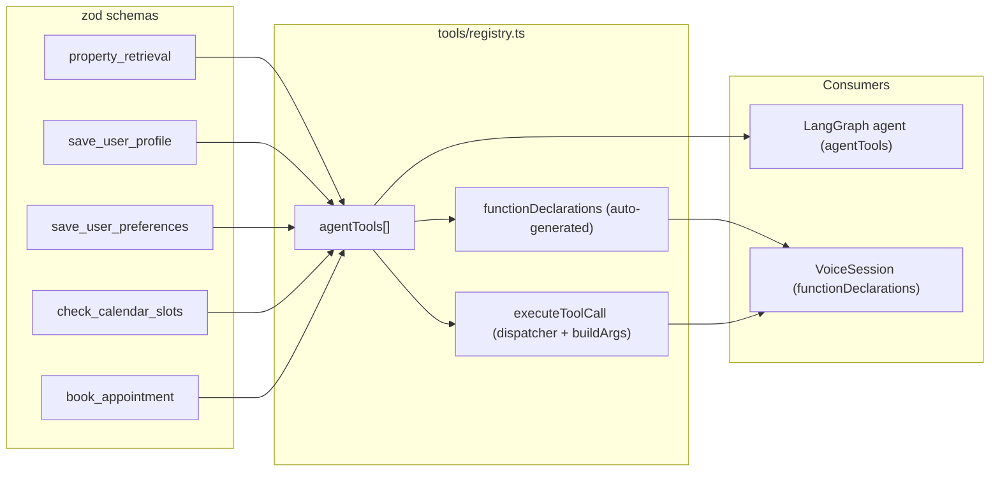

# VoiceAqar — Architecture

Two independent execution paths share the same tools, memory, and infrastructure:

1. **Voice (Gemini Live)** — a single live session handles STT + LLM + TTS natively.
2. **Text Chat (LangGraph)** — classic pipeline: user text → agent (LLM + tools) → reply.

---

## 1. Overall Flow Diagram

---

## 2. Voice Path Detail (Gemini Live)

---

## 3. Text Chat Path Detail (LangGraph)

---

## 4. Tool Registry (single source of truth)

---

## 5. Memory Layers

| Layer | Store | Purpose |
|-------|-------|---------|
| Working Memory | Redis | Transient per-session sliding window of turns |
| Graph Memory | Neo4j | Persistent user profile, preferences, budget, search history, property interactions |
| Relational Memory | PostgreSQL | Properties catalog, users; LangGraph checkpointer (PostgresSaver) |
| Semantic Memory | Qdrant | Vector search over properties (embedding-based) |
| Context Window | In-memory | Session-scoped tool results + memory summary injected into prompt |

---

## 6. Metrics & Observability

Every voice call is scored on the **Opik dashboard** via feedback scores pushed at session close (`VoiceSession.close()`).

**Objective metrics** — computed locally, no extra cost:

| Metric (Opik score) | What it measures |
|---------------------|------------------|
| `ttfa_ms` | User's first audio chunk → first agent audio chunk |
| `e2e_latency_ms` | Last user audio before a response → first agent audio |
| `error_rate` | 1.0 if any session/connection error occurred, else 0 |
| `tool_success_rate` | Successful tool calls / total tool calls |
| `tokens_input` / `tokens_output` | Cumulated usage from Gemini Live `usageMetadata` |
| `cost_usd` | Only when `GEMINI_LIVE_INPUT/OUTPUT_PRICE_PER_MILLION` are set |

**Qualitative metrics** — judged by `GEMINI_EVAL_MODEL` on the call transcript + tool outcomes:

| Metric (Opik score) | What it measures |
|---------------------|------------------|
| `task_success` | Did the agent complete the user's goal |
| `intent_accuracy` | Did the agent understand what the user wanted |
| `response_relevance` | Was each response appropriate to the request |
| `tool_call_accuracy` | Right tools called with correct arguments |

Source: `src/infrastructure/observability/metrics.ts`. The judge is best-effort and never blocks or breaks call teardown.

---

## 7. Personalities

`src/config/personalities.ts` defines a dictionary of personas, each with its own Gemini Live voice (`Puck`, `Charon`, `Kore`, `Fenrir`, ...) and an Egyptian Arabic personality section. Each incoming call picks one **randomly**:

| id | name | voice | personality |
|----|------|-------|-------------|
| `trusted-advisor` | المستشار العقاري | Puck | Calm senior advisor |
| `friendly-broker` | سمسار صديق | Charon | Casual neighborhood broker |
| `elegant-consultant` | مستشارة راقية | Kore | Polished luxury consultant |
| `energetic-seller` | مبيعات نشيط | Fenrir | Energetic sales closer |

---

## 8. Key Files

| File | Responsibility |
|------|----------------|
| `src/server.ts` | HTTP + WS server, route mounting, gateways, rate limiting |
| `src/gateway/gemini_live_gateway.ts` | Web transport for `/ws/voice-live` (raw PCM) |
| `src/gateway/twilio_gateway.ts` | Twilio Media Streams transport (mulaw ↔ PCM) |
| `src/gateway/voice_session.ts` | Shared live-session core: connect, messages, tools, memory, Opik, metrics |
| `src/tools/registry.ts` | Single tool source of truth, zod→Gemini converter, dispatcher |
| `src/tools/*.ts` | Individual tools (property, profile, preferences, booking) |
| `src/agent/voiceaqar_agent.ts` | LangGraph React agent + PostgresSaver + initialization |
| `src/agent/prompt.ts` | System prompt, current-date context, budget confirmation, Opik sync |
| `src/config/personalities.ts` | Random voice + persona dictionary |
| `src/infrastructure/observability/metrics.ts` | Objective + LLM-judged metric computation, Opik score push |
| `src/infrastructure/memory/memory_manager.ts` | Orchestrates all memory layers, builds agent context |
| `src/infrastructure/calendar/google_calendar.ts` | Service-account auth, freebusy, available slots, booking |
| `src/config/env.ts` | Zod-validated environment config |
| `src/utils/audio_helper.ts` | mulaw encode/decode, resampling (Twilio) |